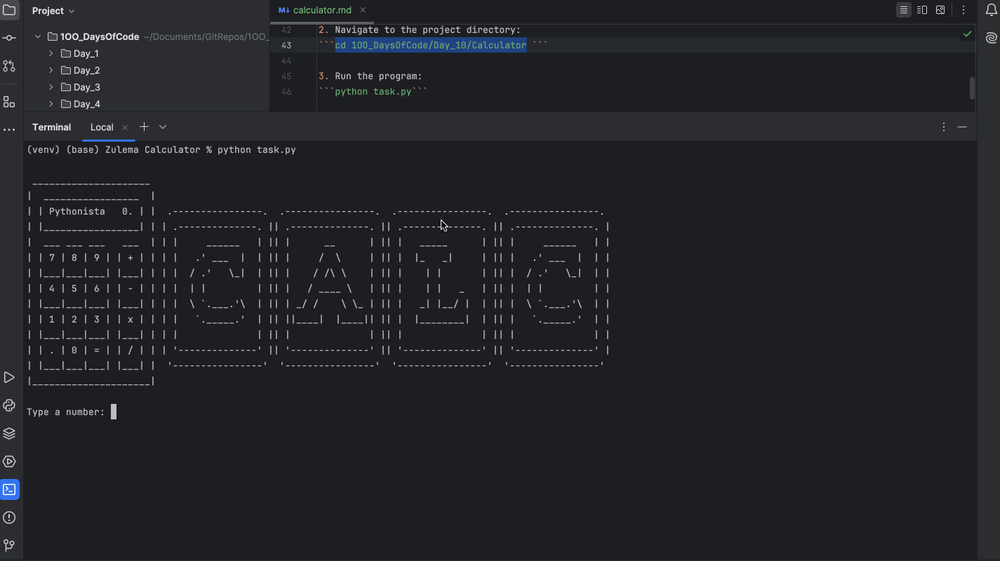

# Calculator

## Table of Contents
- [About](#about)
- [Features](#features)
- [How to Use](#how-to-use)
- [Example](#example)
- [Requirements](#requirements)
- [Installation](#installation)

## About
This program is a simple command-line calculator that performs basic arithmetic operations.  
Users can add, subtract, multiply, or divide two numbers, and choose to continue calculations with the previous result.  

## Features
- Supports four basic operations: addition (`+`), subtraction (`-`), multiplication (`*`), and division (`/`).
- Validates numeric inputs and rejects invalid entries.
- Prevents division by zero with a clear error message.
- Option to continue calculations with the previous result.
- Displays an ASCII art logo using the `art` module.

## How to Use
1. Run the program.
2. Enter your first number when prompted.
3. Choose an operator from `+`, `-`, `*`, or `/`.
4. Enter the second number.
5. The program displays the result.
6. Choose whether to:
   - Continue using the previous result for more calculations.
   - Exit the program.
   
## Example
)

## Requirements
- Python 3.12.2 

## Installation
1. Clone this repository:
```git clone https://github.com/ZulemaArteaga/1OO_DaysOfCode ```

2. Navigate to the project directory:
```cd 1OO_DaysOfCode/Day_10/Calculator ```

3. Run the program:
```python task.py```