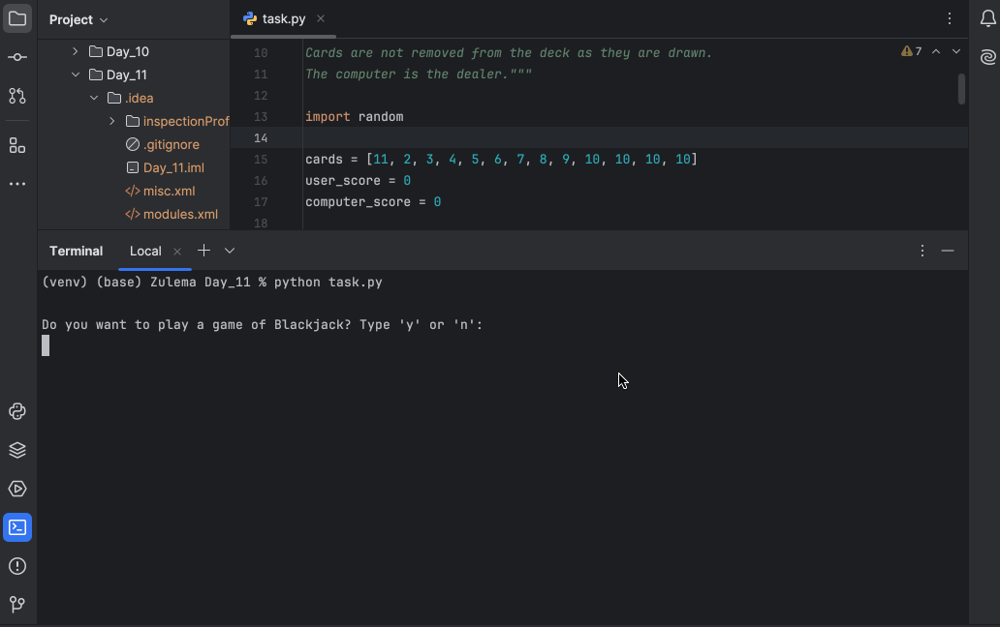

# Blackjack Game

## Table of Contents
- [About](#about)
- [Features](#features)
- [How to Use](#how-to-use)
- [Example](#example)
- [Requirements](#requirements)
- [Installation](#installation)

## About
This program is a command-line Blackjack game where you play against the computer dealer.  

## Features
- Uses an unlimited deck with equal probability draws (no card removal).
- Jack, Queen, and King cards count as 10.
- Ace counts as 11 or 1, automatically adjusted to prevent busting.
- Dealer (computer) draws cards until reaching at least 17.
- Detects Blackjack, busts, wins, losses, and draws.

## How to Use
1. Run the program.
2. When prompted, type `y` to start a game or `n` to exit.
3. Your initial two cards and score will be shown.
4. Choose whether to draw another card by typing `y` or stop by typing `n`.
5. The computer dealer will draw cards as needed.
6. The winner or draw result will be displayed.
7. You can choose to play again or quit.

## Example
)

## Requirements
- Python 3.x

## Installation
1. Clone this repository:
```git clone https://github.com/ZulemaArteaga/1OO_DaysOfCode ```

2. Navigate to the project directory:
```cd 1OO_DaysOfCode/Day_11```

3. Run the program:
```python task.py```