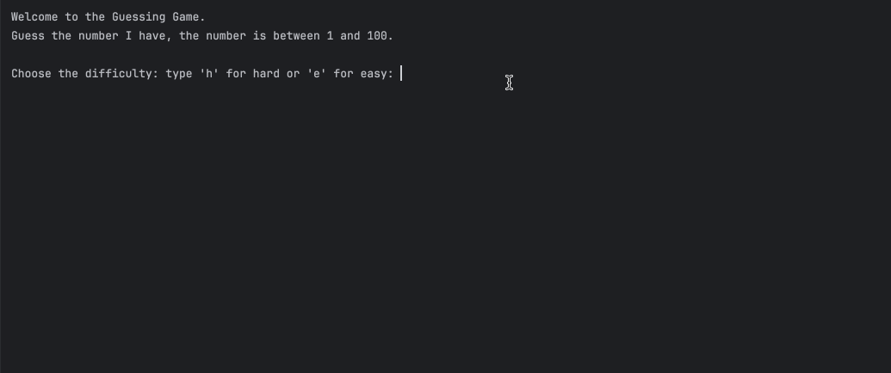

# Number Guessing Game

## Table of Contents
- [About](#about)
- [Features](#features)
- [How to Use](#how-to-use)
- [Example](#example)
- [Requirements](#requirements)
- [Installation](#installation)

## About
This program is a number guessing game where the player tries to guess a number randomly chosen by the computer.  

The computer provides hints if the guess is too high or too low, and the game ends when the player guesses correctly or runs out of attempts.

## Features
- Randomly generates a number between 1 and 100.
- Two difficulty levels:
  - Easy: 10 attempts.
  - Hard: 5 attempts.
- Provides feedback if the guess is too high or too low.
- Ends game when player guesses the number or runs out of attempts.

## How to Use
1. Run the program.
2. Choose a difficulty level:
   - Type `e` for easy (10 attempts).
   - Type `h` for hard (5 attempts).
3. Enter your guesses one at a time.
4. The program will:
   - Tell you if your guess is too high or too low.
   - Show remaining attempts.
5. The game ends when you guess the number or run out of attempts.

## Example
)

## Requirements
- Python 3.12.2 

## Installation
1. Clone this repository:
```git clone https://github.com/ZulemaArteaga/1OO_DaysOfCode ```

2. Navigate to the project directory:
```cd 1OO_DaysOfCode/Day_12/Number_Guessing_project ```

3. Run the program:
```python main.py```