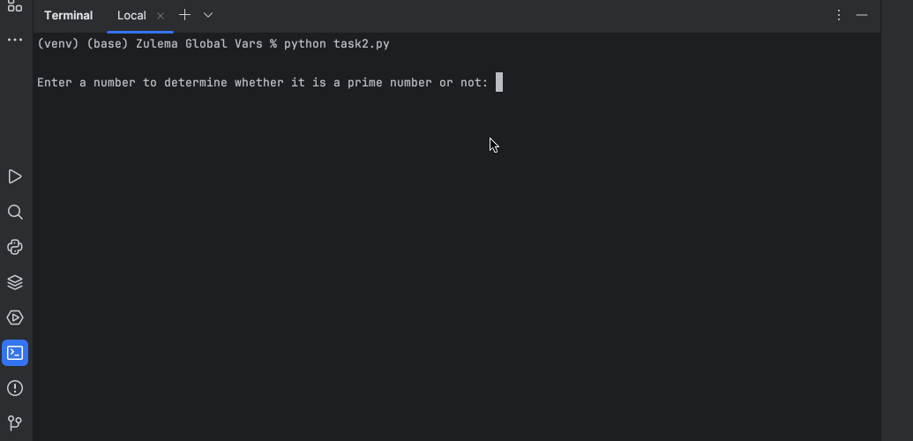

# Prime Number Checker

## Table of Contents
- [About](#about)
- [Features](#features)
- [How to Use](#how-to-use)
- [Example](#example)
- [Requirements](#requirements)
- [Installation](#installation)

## About
This program checks whether a given number is a prime number or not.  
A prime number is a number that can only be divided evenly by 1 and itself.  

## How to Use
1. Run the program.
2. Enter a positive integer when prompted.
3. The program will:
   - Check if the number is prime.
   - Print whether it is a prime number or not.

## Example
 )

## Requirements
- Python 3.12.2 

## Installation
1. Clone this repository:
```git clone https://github.com/ZulemaArteaga/1OO_DaysOfCode ```

2. Navigate to the project directory:
```cd 1OO_DaysOfCode/Day_12 ```

3. Run the program:
```python task.py```