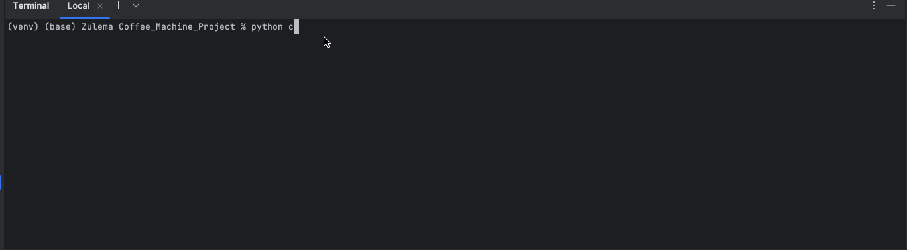

# Virtual Coffee Machine

## Table of Contents
- [About](#about)
- [Features](#features)
- [How to Use](#how-to-use)
- [Example](#example)
- [Requirements](#requirements)
- [Installation](#installation)

## About
This program simulates a virtual coffee machine with three drink options: espresso, latte, and cappuccino.  

It manages ingredient levels (water, milk, coffee), processes payments, and tracks profits.  

A built-in `report` command displays current resource levels and profit.

## Features
- Three drink options:
  - Espresso
  - Latte
  - Cappuccino
- Tracks:
  - Water (ml)
  - Milk (ml)
  - Coffee (g)
  - Profit ($)
- Accepts coins: quarters, dimes, nickels, and pennies.
- Validates:
  - Ingredient availability before making a drink.
  - Sufficient payment before processing.
- Provides change if overpaid.
- `report` command shows current machine status.
- `off` command shuts down the machine.

## How to Use
1. Run the program.
2. Type your desired drink:
   - `espresso`
   - `latte`
   - `cappuccino`
3. Insert coins when prompted.
4. If payment is sufficient and ingredients are available:
   - Your drink will be made.
   - Any change will be returned.
5. Special commands:
   - Type `report` to see current resources and profit.
   - Type `off` to turn off the machine.

## Example
 
 
## Requirements
- Python 3.12.2 

## Installation
1. Clone this repository:
```git clone https://github.com/ZulemaArteaga/1OO_DaysOfCode ```

2. Navigate to the project directory:
```cd 1OO_DaysOfCode/Day_15/Coffe_Machine_Project```

3. Run the program:
```python main.py```
