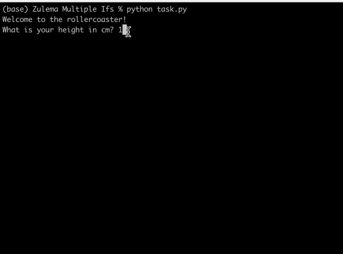

# Rollercoaster

## Table of Contents
- [About](#about)
- [Features](#features)
- [How to Use](#how-to-use)
- [Example](#example)
- [Requirements](#requirements)
- [Installation](#installation)

## About
This is a simple Python program that determines if a person can ride a rollercoaster based on their height and calculates the ticket price based on their age. It also offers an optional photo service.


## Features
- Checks if the user meets the height requirement to ride.
-  Calculates ticket price based on age:
  --$5 for kids (12 and under)
  --$7 for teens (13–18)
  --$12 for adults (19+)
- Adds an optional $3 for a photo.
- Displays the total bill at the end.

## How to Use
1. Run the program.
2. Enter your height in cm when prompted.
3. If you are tall enough, enter your age when asked.
4. The program will show the ticket price based on your age group.
5. Choose whether you want a photo taken (adds $3 to the bill).
6. View the final amount you need to pay.

## Example

)


## Requirements
Python 3.12.2 intalled on your system.

## Installation
1. Clone this repository:

```git clone https://github.com/ZulemaArteaga/1OO_DaysOfCode ```

2. Navigate to the project directory:

```cd 1OO_DaysOfCode/Day_3/Multiple\ Ifs```


3. Run the program:
```python task.py```