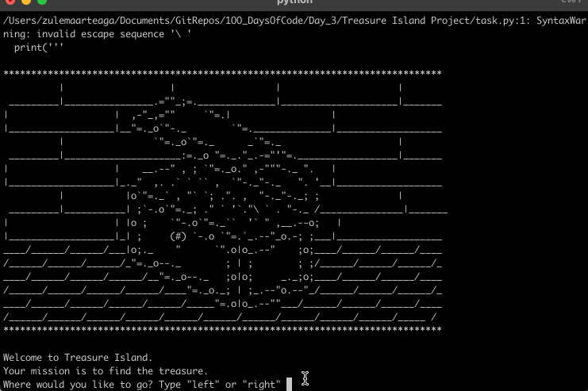

# Treasure Island 

## Table of Contents
- [About](#about)
- [Features](#features)
- [How to Use](#how-to-use)
- [Example](#example)
- [Requirements](#requirements)
- [Installation](#installation)

## About
Treasure Island is a simple text-based adventure game written in Python.
Your mission is to navigate through choices and find the hidden treasure.
Make the wrong decision, and the game ends. Choose wisely, and you win!

## Features
- Interactive text-based adventure.
- Multiple decision paths with different outcomes.
- Beginner-friendly Python code for learning if/else statements.
- Simple and lightweight; runs in any terminal.

## How to Use
1. Run the program in your terminal.
2. Follow the prompts and type your choices (left or right, swim or wait, etc.).
3. Your decisions determine whether you find the treasure or “Game Over”.

## Example

)


## Requirements
Python 3.12.2 intalled on your system.

## Installation
1. Clone this repository:

```git clone https://github.com/ZulemaArteaga/1OO_DaysOfCode ```

2. Navigate to the project directory:

```cd 1OO_DaysOfCode/Day_3/Treasure\ Island\ Project```

3. Run the program:
```python task.py```