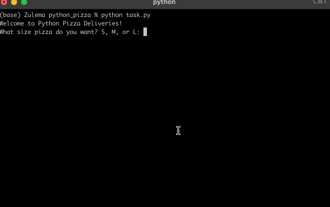

# Pizza Delivery

## Table of Contents
- [About](#about)
- [Features](#features)
- [How to Use](#how-to-use)
- [Example](#example)
- [Requirements](#requirements)
- [Installation](#installation)

## About
A simple Python program to calculate the final bill for a pizza order based on size, pepperoni topping, and extra cheese.

## Features
- Choose pizza size: Small, Medium, or Large
- Add pepperoni topping with price varying by pizza size
- Add extra cheese for a fixed price
- Calculates and displays the final bill

## How to Use
Run the program and follow the prompts:
1. Select your pizza size (S, M, or L).
2. Choose whether you want pepperoni (Y or N).
3. Choose whether you want extra cheese (Y or N).
4. Get your final bill amount displayed..

## Example

)


## Requirements
Python 3.12.2 intalled on your system.

## Installation
1. Clone this repository:

```git clone https://github.com/ZulemaArteaga/1OO_DaysOfCode ```

2. Navigate to the project directory:

```cd 1OO_DaysOfCode/Day_3/python_pizza```

3. Run the program:
```python task.py```