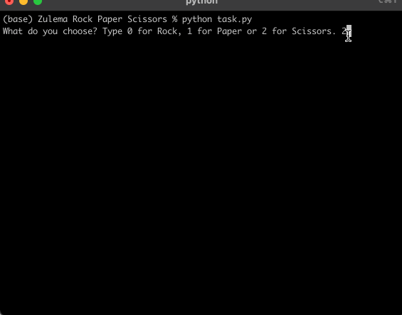

# Rock, Paper, Scissors

## Table of Contents
- [About](#about)
- [Features](#features)
- [How to Use](#how-to-use)
- [Example](#example)
- [Requirements](#requirements)
- [Installation](#installation)

## About
This is a simple Rock, Paper, Scissors game implemented in Python. It uses emojis to represent the choices and lets you play against the computer. The game continues to prompt you until you make a valid choice, then compares your pick against the computer’s to decide the winner.

## Features
- Interactive Gameplay – Play directly in your terminal.
- Computer Opponent – The computer makes random choices each round.
- Emoji-Based Display – Rock, paper, and scissors are represented with emojis for a better experience.
- Input Validation – Handles invalid entries and prompts you to try again.
- Winner Detection – Determines whether the player, computer, or no one wins.

## How to Use
1. Run the program in your terminal.
2. Follow the prompts and type your choice (0 for Rock, 1 for Paper, 2 for Scissors).
3. The computer makes its move and the game announces whether you win, lose, or tie.

## Example

)


## Requirements
Python 3.12.2 intalled on your system. 

```pip install emoji```

```import random```

## Installation
1. Clone this repository:

```git clone https://github.com/ZulemaArteaga/1OO_DaysOfCode ```

2. Navigate to the project directory:

```cd 1OO_DaysOfCode/Day_3/Rock\ Paper\ Scissors```

3. Run the program:
```python task.py```
