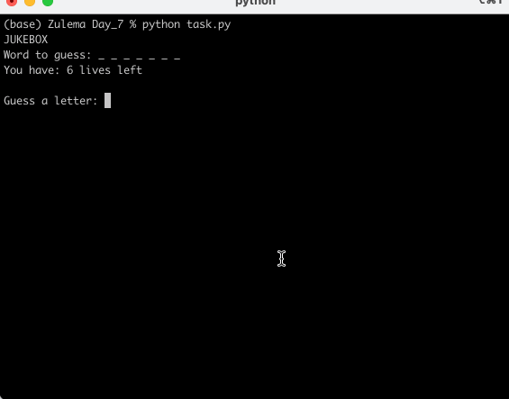

# hangman 

## Table of Contents
- [About](#about)
- [Features](#features)
- [How to Use](#how-to-use)
- [Example](#example)
- [Requirements](#requirements)
- [Installation](#installation)

## About
This project is a Python implementation of the classic Hangman game. Players must guess letters to reveal a hidden word before running out of lives. Each incorrect guess reduces the player's lives until they either guess the full word or lose the game.

## Features
- Randomly selects a word from a predefined word list.
- Displays underscores for unguessed letters.
- Tracks and updates guessed letters as the game progresses.
- Limits input to a single alphabetical character.
- Shows a visual representation of the hangman with each incorrect guess.
- Ends the game with a win or lose message.

## How to Use
1. Run the program.
2. The game will:
   - Display underscores representing the hidden word.
   - Prompt you to guess a letter.
   - Update the display for correct guesses.
   - Reduce lives for incorrect guesses.
3. Keep guessing until:
   - You reveal all the letters (**You Win!**).
   - Or you run out of lives (**Game Over!**).

## Example
)

## Requirements
- Python 3.12.2 

## Installation
1. Clone this repository:
```git clone https://github.com/ZulemaArteaga/1OO_DaysOfCode ```

2. Navigate to the project directory:
```cd 1OO_DaysOfCode/Day_7```

3. Run the program:
```python task.py```
